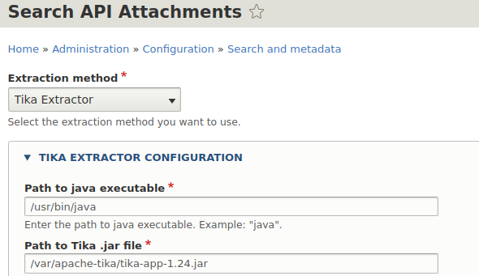
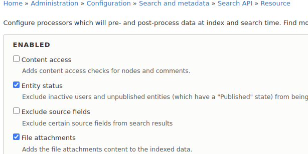
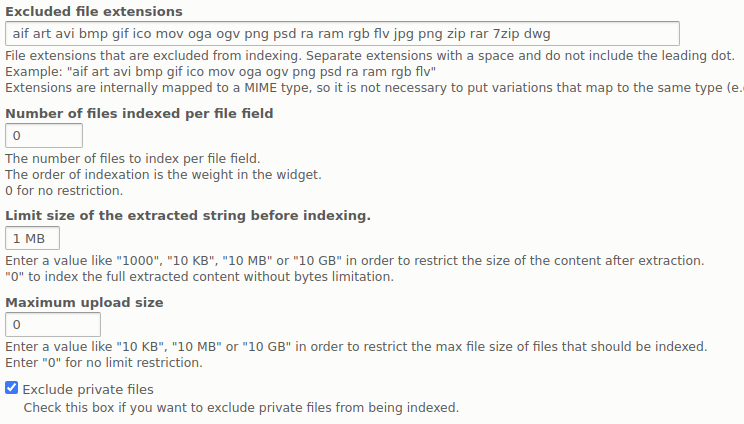
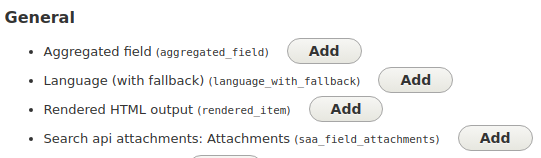
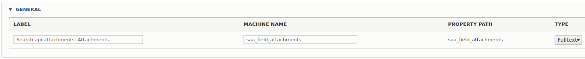

### Configuration needed for indexing attachments in ES7 and Solr

1. install via composer


2. configure _Search API Attachments_
```
download file https://archive.apache.org/dist/tika/tika-app-1.24.jar
```


3. enable Indexing of attachments for `resource`


4. define exclusions and adjust size if needed


5. add `attachments_field` to search api indexing


6. change `string` to `fulltext`

